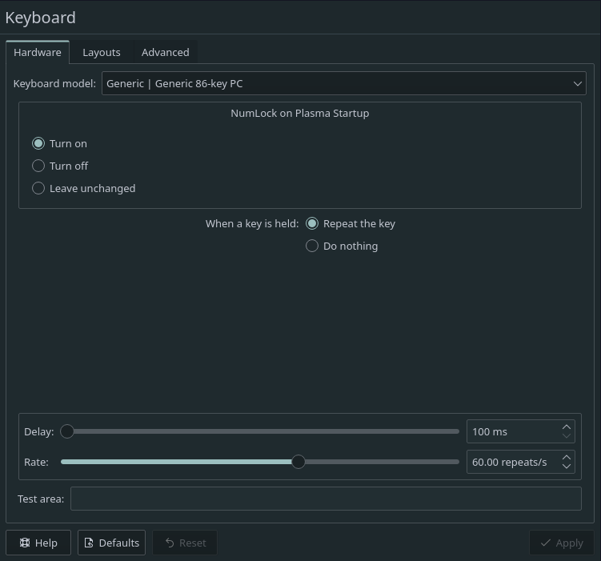

# Batter
What's your batting average? Find out with this terminal version of the arcade 
classic. The goal is simple. Just bat the ball at the blricks until there are 
none left. If you miss the ball the game is over.

## Getting Started
---
Make sure you have Python 3.8.0 or newer and asciimatics 1.12.0 or new installed 
and running on your machine. You can install Asciimatics by opening a terminal 
and running the following command.
```
python3 -m pip install asciimatics
```
After you've installed the required libraries, open a terminal and browse to the 
project's root folder. Start the program by running the following command.
```
python3 batter 
```
You can also run the program from an IDE like Visual Studio Code. Start your IDE 
and open the project folder. Select the main module inside the hunter folder and 
click the "run" icon.

If your input appears to be delayed, try changing your operating system's keyboard settings to reduce the delay for repeating keys:


**Make sure to reset your configuration when done playing.**

## Project Structure
---
The project files and folders are organized as follows:
```
root                                  (project root folder)
+-- batter                            (source code for game)
  +-- game                            (specific game classes)
    +-- action.py                     (Controller)
    +-- actor.py                      (Information Holder)
    +-- constants.py                  (Game Constants)
    +-- control_actors_action.py      (Controller)
    +-- director.py                   (Controller)
    +-- draw_actors_action.py         (Controller)
    +-- handle_collisions_action.py   (Controller)
    +-- input_service.py              (Service Provider)
    +-- move_actors_action.py         (Controller)
    +-- output_service.py             (Service Provider)
    +-- point.py                      (Information Holder)
  +-- __init__.py       (python package file)
  +-- __main__.py       (entry point for program)
+-- README.md           (general info)
```

## Required Technologies
---
* Python 3.8.0
* Asciimatics 1.12.0

## Authors
---
* Bryndi Hellewell - brynlol12@gmail.com
* Chase Odermott - ode16003@byui.edu
* Carson Bush - hyperdriveguy@byui.edu